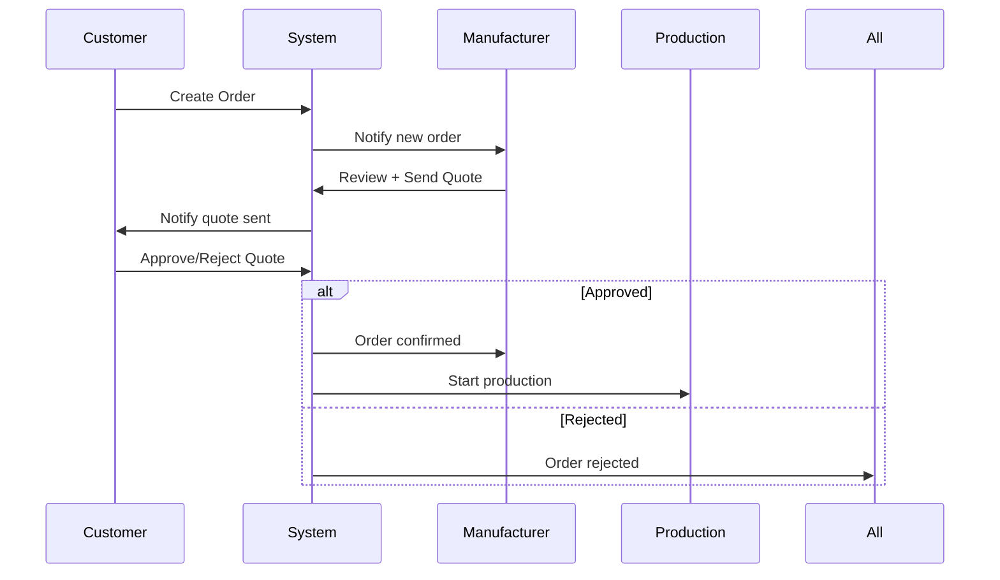

# 🔍 İŞ AKIŞI EKSİKLİKLERİ ANALİZİ

**Analiz Tarihi:** 15 Ekim 2025
**Proje:** B2B Tekstil Üretim Yönetim Sistemi
**Durum:** %95 Tamamlanmış - Kritik Eksiklikler Tespit Edildi

---

## 📋 İÇİNDEKİLER

1. [Kritik Eksiklikler](#kritik-eksiklikler)
2. [İş Akışı Boşlukları](#iş-akışı-boşlukları)
3. [Eksik Özellikler](#eksik-özellikler)
4. [Teknik Borçlar](#teknik-borçlar)
5. [Öncelikli Aksiyonlar](#öncelikli-aksiyonlar)

---

## ❌ KRİTİK EKSİKLİKLER

### 1. 💰 **ÖDEME YÖNETİM SİSTEMİ** - %0 TAMAMLANMIŞ

**Mevcut Durum:** Database'de payment field'ları var ama hiç API yok!

#### Database Schema (Hazır):
```prisma
model Order {
  // Payment fields MEVCUT ama API YOK!
  advancePayment    Float?           // Avans ödemesi
  remainingBalance  Float?           // Kalan bakiye
  totalPrice        Float            // Toplam tutar
  unitPrice         Float            // Birim fiyat
}
```

#### Eksik API'lar:
```graphql
# ❌ YOK - Ödeme işlemi
mutation ProcessPayment(
  $orderId: Int!
  $amount: Float!
  $paymentMethod: PaymentMethod!
  $transactionId: String
) {
  processPayment(...)
}

# ❌ YOK - Avans ödemesi
mutation RecordAdvancePayment(
  $orderId: Int!
  $amount: Float!
  $paymentDate: DateTime!
) {
  recordAdvancePayment(...)
}

# ❌ YOK - Kalan bakiye ödemesi
mutation RecordRemainingPayment(
  $orderId: Int!
  $amount: Float!
) {
  recordRemainingPayment(...)
}

# ❌ YOK - Ödeme geçmişi
query PaymentHistory($orderId: Int!) {
  paymentHistory(orderId: $orderId) {
    id
    amount
    paymentMethod
    transactionId
    status
    createdAt
  }
}
```

#### Eksik Özellikler:
- ❌ Ödeme gateway entegrasyonu (Stripe, PayPal, Iyzico)
- ❌ Fatura oluşturma ve yönetimi
- ❌ Ödeme durumu takibi
- ❌ Otomatik ödeme hatırlatmaları
- ❌ Avans/taksit sistemi
- ❌ Para birimi dönüşümü (USD/EUR/TRY)

**Etki:** 🔴 KRİTİK - Sipariş süreci tamamlanamıyor!

---

### 2. 📧 **BİLDİRİM SİSTEMİ** - %10 TAMAMLANMIŞ

**Mevcut Durum:** Sadece frontend UI mockup var, backend HİÇ YOK!

#### Eksik Backend:
```typescript
// ❌ YOK - Notification Model
model Notification {
  id        Int      @id @default(autoincrement())
  userId    Int
  type      NotificationType
  title     String
  message   String
  isRead    Boolean  @default(false)
  data      Json?    // Additional context
  createdAt DateTime @default(now())

  user User @relation(fields: [userId], references: [id])
}

enum NotificationType {
  ORDER_STATUS
  SAMPLE_UPDATE
  PRODUCTION_MILESTONE
  QUALITY_RESULT
  MESSAGE
  PAYMENT
  SYSTEM
}
```

#### Eksik API'lar:
```graphql
# ❌ YOK - Bildirim oluşturma
mutation CreateNotification(
  $userId: Int!
  $type: NotificationType!
  $title: String!
  $message: String!
) {
  createNotification(...)
}

# ❌ YOK - Bildirim listesi
query MyNotifications($isRead: Boolean) {
  myNotifications(isRead: $isRead) {
    id
    type
    title
    message
    isRead
    createdAt
  }
}

# ❌ YOK - Okundu işaretleme
mutation MarkNotificationAsRead($id: Int!) {
  markNotificationAsRead(id: $id)
}

# ❌ YOK - Tümünü okundu işaretle
mutation MarkAllAsRead {
  markAllNotificationsAsRead
}
```

#### Eksik Real-time Features:
```graphql
# ❌ YOK - WebSocket Subscription
subscription NotificationReceived($userId: Int!) {
  notificationReceived(userId: $userId) {
    id
    type
    title
    message
    createdAt
  }
}
```

#### Eksik Email Service:
```typescript
// ❌ YOK - Email templates
- Welcome email
- Order confirmation
- Production updates
- Quality alerts
- Payment reminders

// ❌ YOK - Email service configuration
- SMTP settings
- Template engine
- Email queue system
```

**Etki:** 🔴 KRİTİK - Kullanıcılar önemli güncellemelerden haberdar olamıyor!

---

### 3. 📄 **DÖKÜMAN/FATURA YÖNETİMİ** - %5 TAMAMLANMIŞ

**Mevcut Durum:** File upload var ama döküman yönetimi YOK!

#### Eksik Features:
```graphql
# ❌ YOK - Invoice model
model Invoice {
  id            Int      @id @default(autoincrement())
  orderId       Int      @unique
  invoiceNumber String   @unique
  issueDate     DateTime @default(now())
  dueDate       DateTime
  subtotal      Float
  tax           Float
  total         Float
  status        InvoiceStatus @default(UNPAID)
  pdfPath       String?

  order Order @relation(fields: [orderId], references: [id])
}

# ❌ YOK - Document management
model Document {
  id           Int          @id @default(autoincrement())
  type         DocumentType // CONTRACT, INVOICE, CERTIFICATE, TECH_SPEC
  title        String
  filePath     String
  uploadedBy   Int
  relatedTo    String?      // orderId, sampleId
  createdAt    DateTime     @default(now())
}
```

#### Eksik API'lar:
```graphql
# ❌ YOK - Fatura oluşturma
mutation GenerateInvoice($orderId: Int!) {
  generateInvoice(orderId: $orderId) {
    id
    invoiceNumber
    pdfUrl
  }
}

# ❌ YOK - Döküman listesi
query MyDocuments($type: DocumentType) {
  myDocuments(type: $type) {
    id
    title
    type
    filePath
    createdAt
  }
}

# ❌ YOK - PDF oluşturma
mutation GeneratePDF($orderId: Int!, $type: PDFType!) {
  generatePDF(orderId: $orderId, type: $type)
}
```

**Etki:** 🟡 ORTA - İş sürekliliği için gerekli!

---

### 4. 🔔 **GERÇEK ZAMANLI GÜNCELLEMELER** - %0 TAMAMLANMIŞ

**Mevcut Durum:** GraphQL Subscriptions HİÇ IMPLEMENT EDİLMEMİŞ!

#### Eksik WebSocket Infrastructure:
```typescript
// ❌ YOK - Apollo Server subscription config
import { createServer } from 'http';
import { WebSocketServer } from 'ws';
import { useServer } from 'graphql-ws/lib/use/ws';

// ❌ YOK - Subscription resolvers
subscription ProductionUpdated($productionId: Int!) {
  productionUpdated(productionId: $productionId) {
    id
    currentStage
    overallStatus
    updatedAt
  }
}

subscription MessageReceived($userId: Int!) {
  messageReceived(userId: $userId) {
    id
    content
    sender { username }
  }
}

subscription QualityControlCompleted($productionId: Int!) {
  qualityControlCompleted(productionId: $productionId) {
    result
    score
  }
}
```

**Etki:** 🟡 ORTA - Kullanıcı deneyimi için önemli!

---

## 🔄 İŞ AKIŞI BOŞLUKLARI

### 1. 🛒 **SİPARİŞ ONAY WORKFLOW'U**

**Sorun:** Sipariş onaylama süreci eksik!

#### Mevcut Flow (Eksik):
```
Customer → Create Order (PENDING)
   ↓
Manufacturer → Review Order (???)
   ↓
   ? Fiyat teklifi nasıl gönderilecek?
   ? Müşteri onayı nasıl alınacak?
   ↓
Order → CONFIRMED
```

#### Olması Gereken Flow:


#### Eksik API'lar:
```graphql
# ❌ YOK - Teklif gönderme
mutation SendQuote(
  $orderId: Int!
  $unitPrice: Float!
  $totalPrice: Float!
  $productionDays: Int!
  $notes: String
) {
  sendQuote(...)
}

# ❌ YOK - Teklifi onaylama
mutation ApproveQuote($orderId: Int!) {
  approveQuote(orderId: $orderId)
}

# ❌ YOK - Teklifi reddetme
mutation RejectQuote($orderId: Int!, $reason: String!) {
  rejectQuote(orderId: $orderId, reason: $reason)
}

# ❌ YOK - Karşı teklif
mutation CounterOffer(
  $orderId: Int!
  $proposedPrice: Float!
  $notes: String
) {
  counterOffer(...)
}
```

**Etki:** 🔴 KRİTİK - Sipariş süreci çalışmıyor!

---

### 2. 📊 **NUMUNE ONAY WORKFLOW'U**

**Sorun:** Müşteri numune onay süreci eksik!

#### Mevcut Flow (Eksik):
```
Sample → COMPLETED
   ↓
   ? Müşteri nasıl onaylayacak?
   ? Revize talebi nasıl oluşturulacak?
   ↓
Order creation
```

#### Olması Gereken Flow:
```graphql
# ❌ YOK - Numune onaylama
mutation ApproveSample($sampleId: Int!) {
  approveSample(sampleId: $sampleId) {
    id
    isApproved
    status
  }
}

# ❌ YOK - Numune reddetme + revize talebi
mutation RequestSampleRevision(
  $sampleId: Int!
  $revisionNotes: String!
  $changes: [RevisionChange!]!
) {
  requestSampleRevision(...)
}

# Revision changes örnek:
type RevisionChange {
  field: String!        # "color", "size", "fabric"
  oldValue: String!
  newValue: String!
  notes: String
}
```

**Etki:** 🔴 KRİTİK - Numune-sipariş geçişi çalışmıyor!

---

### 3. 🏭 **ÜRETİM İPTAL/DEĞİŞİKLİK WORKFLOW'U**

**Sorun:** Üretim sırasında değişiklik/iptal süreci yok!

#### Eksik Scenarios:
```graphql
# ❌ YOK - Müşteri sipariş iptali
mutation CancelOrder(
  $orderId: Int!
  $reason: String!
  $cancellationFee: Float?
) {
  cancelOrder(...)
}

# ❌ YOK - Sipariş değişikliği
mutation ModifyOrder(
  $orderId: Int!
  $changes: OrderModificationInput!
) {
  modifyOrder(...)
}

# ❌ YOK - Miktar değişikliği
mutation ChangeOrderQuantity(
  $orderId: Int!
  $newQuantity: Int!
  $priceAdjustment: Float!
) {
  changeOrderQuantity(...)
}
```

**Etki:** 🟡 ORTA - İşletme esnekliği için gerekli!

---

## 🚫 EKSİK ÖZELLİKLER

### 1. 📦 **ENVANTER YÖNETİMİ** - %0

**Neden Gerekli:** Stok takibi, hammadde yönetimi

#### Eksik Models:
```prisma
model Inventory {
  id            Int      @id @default(autoincrement())
  itemType      String   // FABRIC, ACCESSORY, FINISHED_PRODUCT
  itemId        Int      // fabric_id, collection_id
  quantity      Int
  unit          String   // METER, PIECE, KG
  minStock      Int      // Minimum stok seviyesi
  maxStock      Int
  location      String?
  lastUpdated   DateTime @updatedAt
}

model StockMovement {
  id          Int      @id @default(autoincrement())
  inventoryId Int
  type        MovementType // IN, OUT, TRANSFER, ADJUSTMENT
  quantity    Int
  reason      String?
  orderId     Int?
  createdAt   DateTime @default(now())
}
```

**Etki:** 🟡 ORTA - Büyük ölçekli üretim için gerekli!

---

### 2. 🚚 **LOJİSTİK ENTEGRASYONU** - %0

**Eksik Features:**
```graphql
# ❌ YOK - Kargo entegrasyonu
mutation CreateShipment(
  $orderId: Int!
  $carrier: String!
  $trackingNumber: String!
) {
  createShipment(...)
}

# ❌ YOK - Kargo tracking
query TrackShipment($orderId: Int!) {
  trackShipment(orderId: $orderId) {
    carrier
    trackingNumber
    status
    estimatedDelivery
    currentLocation
    history {
      timestamp
      status
      location
    }
  }
}
```

**Etki:** 🟡 ORTA - Teslimat takibi için gerekli!

---

### 3. 📊 **RAPORLAMA SİSTEMİ** - %5

**Mevcut Durum:** Sadece dashboard var, detaylı raporlama YOK!

#### Eksik Reports:
```typescript
// ❌ YOK - Production performance report
query ProductionPerformanceReport(
  $startDate: DateTime!
  $endDate: DateTime!
) {
  productionPerformanceReport(...) {
    totalProductions
    avgProductionTime
    delayRate
    onTimeDeliveryRate
    stageBreakdown
    workshopPerformance
  }
}

// ❌ YOK - Quality trend report
query QualityTrendReport($period: Period!) {
  qualityTrendReport(period: $period) {
    passRate
    failRate
    commonDefects
    improvementTrend
  }
}

// ❌ YOK - Financial report
query FinancialReport($month: Int!, $year: Int!) {
  financialReport(month: $month, year: $year) {
    totalRevenue
    paidAmount
    pendingAmount
    profitMargin
    orderCount
  }
}

// ❌ YOK - Customer satisfaction report
query CustomerSatisfactionReport {
  customerSatisfactionReport {
    avgRating
    reviewCount
    repeatCustomerRate
    topComplaints
  }
}
```

**Etki:** 🟡 ORTA - İş zekası için gerekli!

---

### 4. 👥 **EKİP İŞBİRLİĞİ ÖZELLİKLERİ** - %20

#### Eksik Features:
```graphql
# ❌ YOK - Task assignment
mutation AssignTask(
  $userId: Int!
  $taskType: TaskType!
  $relatedId: Int!
  $dueDate: DateTime!
) {
  assignTask(...)
}

# ❌ YOK - Team chat
subscription TeamChat($teamId: Int!) {
  teamChat(teamId: $teamId) {
    message
    sender
    timestamp
  }
}

# ❌ YOK - Activity log
query ActivityLog($userId: Int!) {
  activityLog(userId: $userId) {
    action
    timestamp
    details
  }
}
```

**Etki:** 🟢 DÜŞÜK - İşletme verimliliği için yararlı!

---

## 🛠️ TEKNİK BORÇLAR

### 1. ⚡ **PERFORMANS OPTİMİZASYONU**

#### Eksik Optimizations:
```typescript
// ❌ YOK - Database indexing
@@index([companyId, status])
@@index([customerId, createdAt])
@@index([manufactureId, status, createdAt])

// ❌ YOK - Query optimization
- DataLoader kullanımı
- GraphQL query complexity limiting
- Response caching

// ❌ YOK - File optimization
- Image compression
- CDN entegrasyonu
- Lazy loading
```

---

### 2. 🔐 **GÜVENLİK GELİŞTİRMELERİ**

#### Eksik Security:
```typescript
// ❌ YOK - Rate limiting
app.use('/graphql', rateLimit({
  windowMs: 15 * 60 * 1000,
  max: 100
}))

// ❌ YOK - Input validation middleware
- File upload validation
- SQL injection prevention
- XSS protection

// ❌ YOK - Audit logging
model AuditLog {
  id        Int      @id @default(autoincrement())
  userId    Int
  action    String
  resource  String
  details   Json?
  ipAddress String?
  createdAt DateTime @default(now())
}
```

---

### 3. 📝 **VALIDASYON & ERROR HANDLING**

#### Eksik Validations:
```typescript
// ❌ YOK - Business rule validations
- Sipariş miktarı >= MOQ kontrolü
- Üretim kapasitesi kontrolü
- Stok yeterlilik kontrolü
- Tarih tutarlılık kontrolü

// ❌ YOK - Error handling middleware
- Centralized error handler
- User-friendly error messages
- Error logging & monitoring
```

---

### 4. 🧪 **TEST COVERAGE** - %0

**Sorun:** HİÇ TEST YOK!

#### Eksik Tests:
```typescript
// ❌ YOK - Unit tests
- Resolver tests
- Service layer tests
- Utility function tests

// ❌ YOK - Integration tests
- API endpoint tests
- Database transaction tests
- Authentication tests

// ❌ YOK - E2E tests
- User workflow tests
- Payment flow tests
- Production tracking tests
```

**Etki:** 🔴 KRİTİK - Kod kalitesi ve güvenilirlik için gerekli!

---

## 🎯 ÖNCELİKLİ AKSİYONLAR

### 🔴 **PHASE 1: KRİTİK EKSİKLİKLER** (2-3 Hafta)

#### 1. Ödeme Sistemi (1 hafta)
```typescript
Priority: P0 - CRITICAL
Tasks:
  ✅ Payment model oluşturma
  ✅ Payment API'ları (process, record, history)
  ✅ Frontend ödeme UI
  ⚠️ Gateway entegrasyonu (Stripe/Iyzico)
```

#### 2. Bildirim Sistemi (1 hafta)
```typescript
Priority: P0 - CRITICAL
Tasks:
  ✅ Notification model
  ✅ Notification CRUD API'ları
  ✅ WebSocket subscription setup
  ✅ Frontend notification center integration
  ⚠️ Email service setup
```

#### 3. Sipariş/Numune Workflow (3-5 gün)
```typescript
Priority: P0 - CRITICAL
Tasks:
  ✅ Quote send/approve/reject mutations
  ✅ Sample approval workflow
  ✅ Frontend workflow UI updates
```

---

### 🟡 **PHASE 2: ÖNEMLI EKSİKLİKLER** (3-4 Hafta)

#### 4. Döküman/Fatura Yönetimi (1 hafta)
```typescript
Priority: P1 - HIGH
Tasks:
  ✅ Invoice model & PDF generation
  ✅ Document management system
  ✅ Frontend document viewer
```

#### 5. Raporlama Sistemi (1 hafta)
```typescript
Priority: P1 - HIGH
Tasks:
  ✅ Report query API'ları
  ✅ Chart ve grafik component'leri
  ✅ Export to Excel/PDF
```

#### 6. Lojistik Entegrasyonu (3-5 gün)
```typescript
Priority: P1 - HIGH
Tasks:
  ✅ Shipment tracking API
  ✅ Carrier integration
  ✅ Frontend tracking UI
```

---

### 🟢 **PHASE 3: İYİLEŞTİRMELER** (2-3 Hafta)

#### 7. Performans Optimizasyonu
- Database indexing
- Query optimization
- Caching strategy

#### 8. Test Coverage
- Unit tests (%80+)
- Integration tests
- E2E tests

#### 9. Security Hardening
- Rate limiting
- Audit logging
- Input validation

---

## 📊 ÖZET DEĞERLENDİRME

### Proje Tamamlanma Durumu:

```
✅ Backend Core            : %95  ⭐⭐⭐⭐⭐
✅ Frontend Core           : %90  ⭐⭐⭐⭐⭐
❌ Payment System          : %0   ⭐☆☆☆☆
❌ Notification System     : %10  ⭐☆☆☆☆
❌ Document Management     : %5   ⭐☆☆☆☆
❌ Real-time Features      : %0   ☆☆☆☆☆
❌ Reporting System        : %5   ⭐☆☆☆☆
❌ Testing                 : %0   ☆☆☆☆☆

TOPLAM                    : %75  ⭐⭐⭐⭐☆
```

### Kritik Değerlendirme:

**✅ ÇOK İYİ:**
- Production tracking sistemi mükemmel
- Quality control sistemi tam
- Workshop management hazır
- User & company management komple

**❌ EKSİK:**
- Ödeme sistemi YOK
- Bildirim sistemi sadece UI
- Sipariş onay workflow'u yarım
- Real-time updates YOK
- Test coverage %0

**🎯 SONRAKİ ADIM:**
Phase 1 aksiyonlarına HEMEN başlanmalı!

---

## 📌 SONUÇ

Proje **%75 tamamlanmış** durumda. Backend altyapısı çok güçlü, frontend UI harika ama **4 kritik eksiklik** var:

1. 💰 **Ödeme Sistemi** - Sipariş tamamlanamıyor
2. 🔔 **Bildirim Sistemi** - Kullanıcılar haberdar olamıyor
3. 🔄 **Workflow Gaps** - Onay süreçleri eksik
4. 🧪 **Test Coverage** - Kod güvenliği risk altında

**Tahmini Süre:** 6-8 hafta daha gerekli (Phase 1 + Phase 2)
**Öncelik:** Phase 1 kritik, hemen başlanmalı!

---

**Hazırlayan:** GitHub Copilot AI
**Tarih:** 15 Ekim 2025
