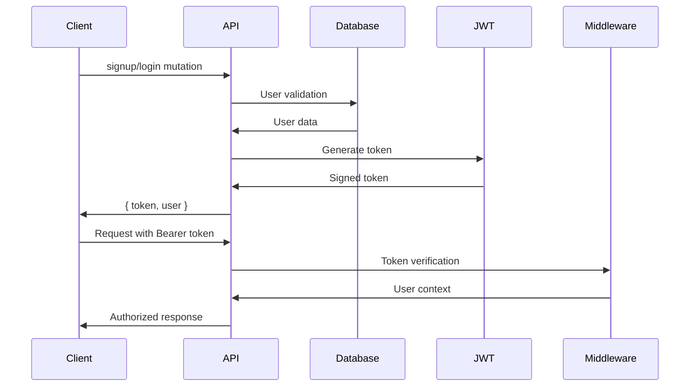
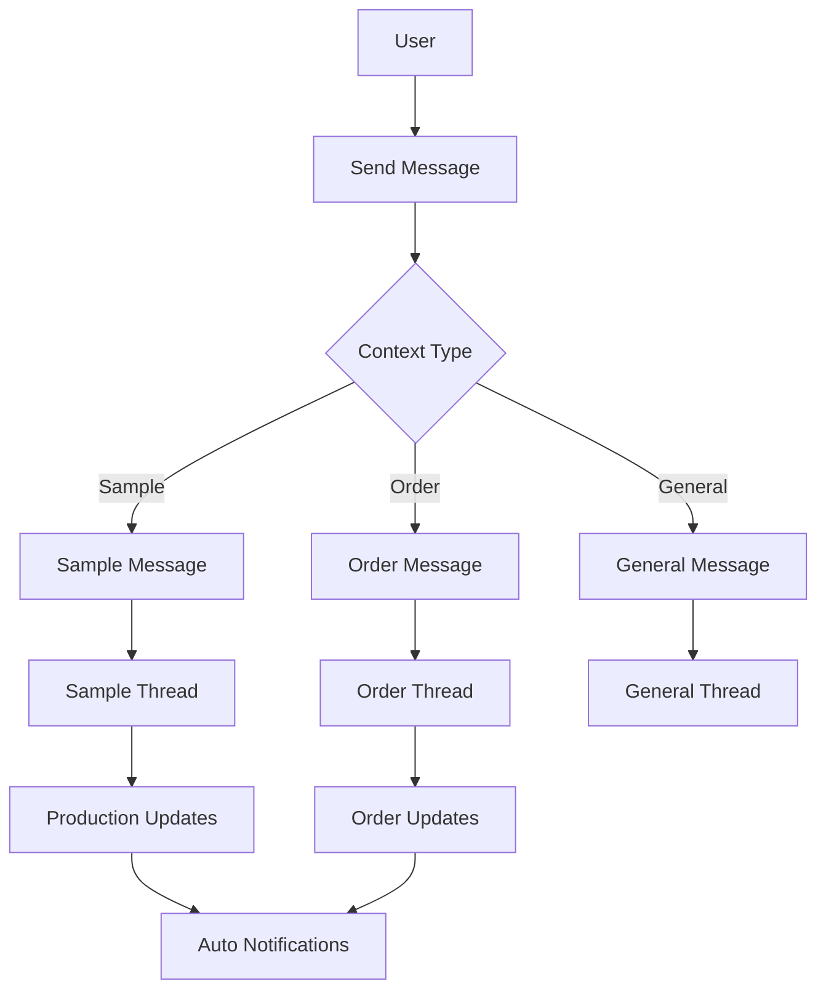
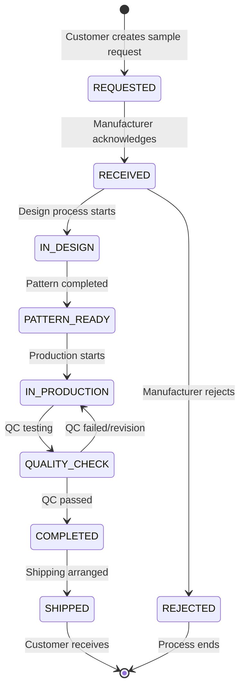
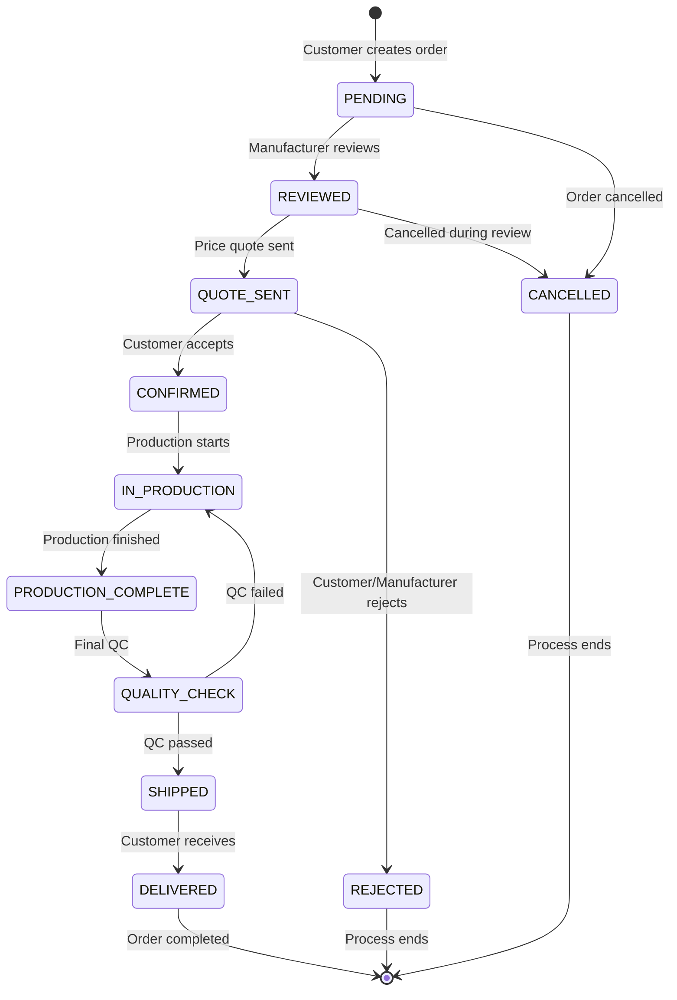
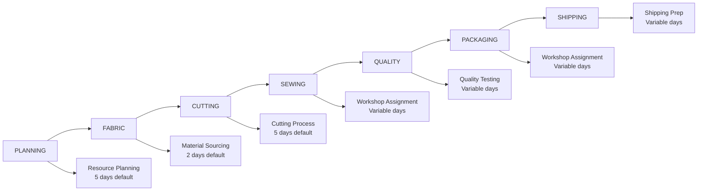
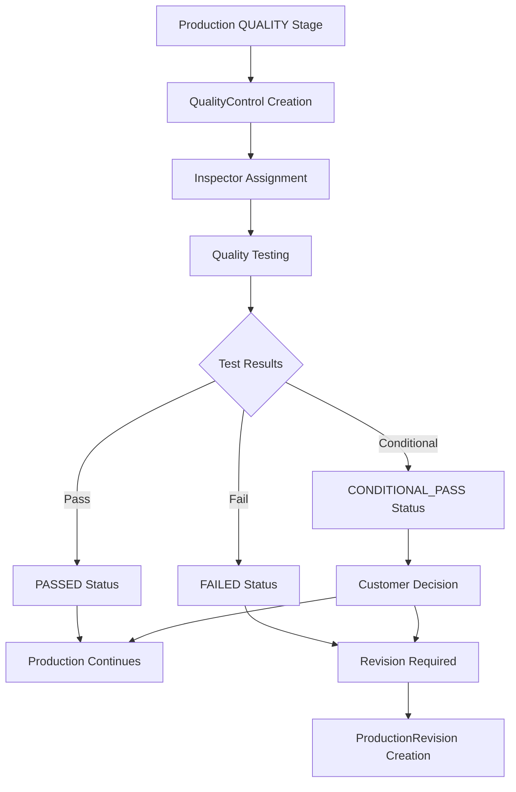
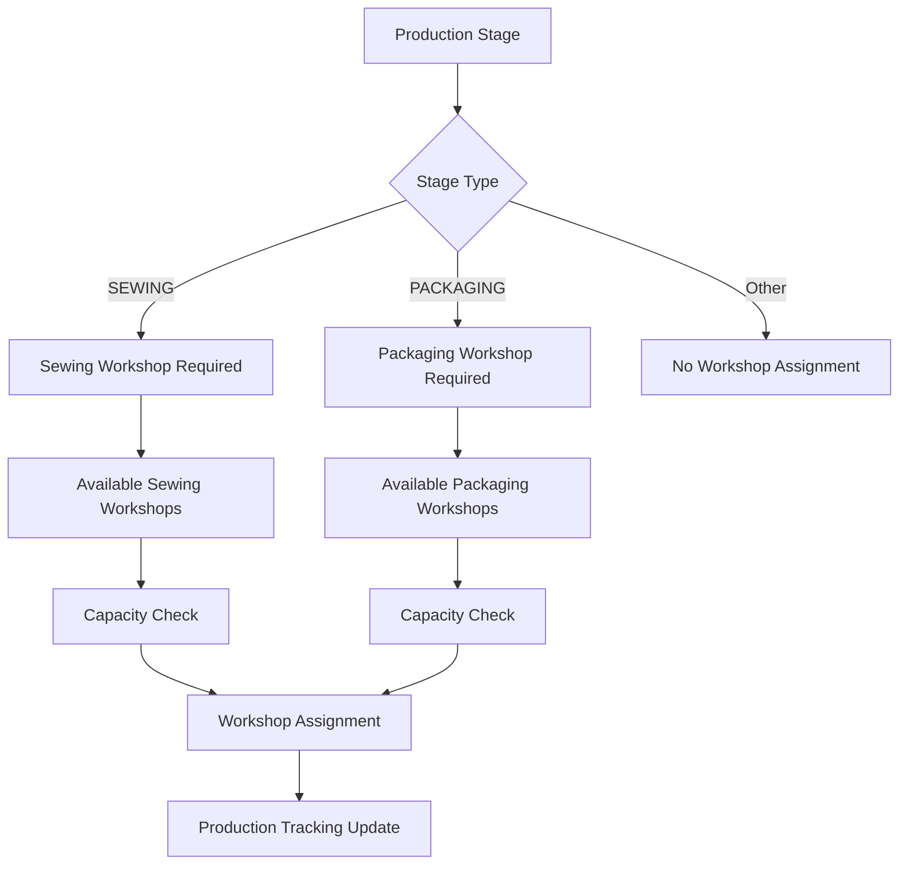
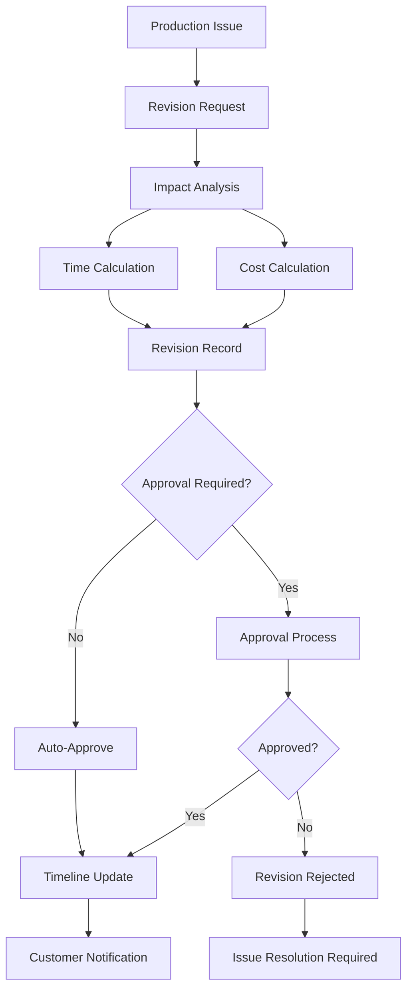
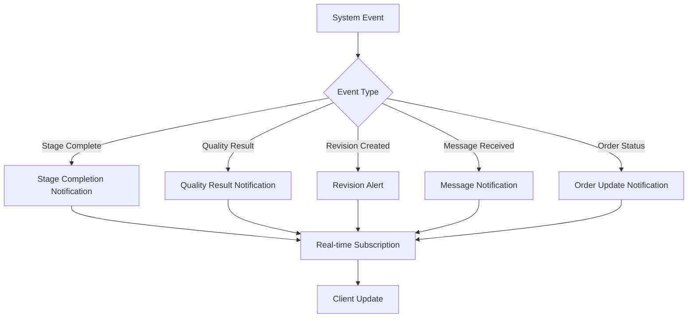
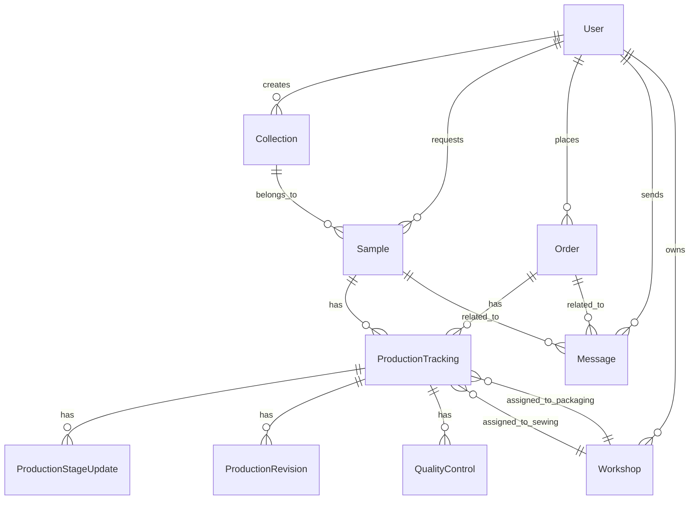

# 🔄 Sistem İş Akışı ve Süreçler - Güncel Sistem (Ekim 2025)

## 🚀 Sistem Mimarisi Özeti

### ✅ Aktif Sistem Bileşenleri

- **GraphQL API**: Apollo Server + Nexus (Modüler)
- **Database**: MySQL + Prisma ORM (11 model)
- **Authentication**: JWT Bearer Token + Permissions
- **Real-time**: Message system (Subscription ready)
- **Production**: 7-stage tracking system
- **Quality**: Automated QC system
- **Workshop**: Assignment and management

### 🏗️ Modüler GraphQL Yapısı

```
/server/src/graphql/
├── schema.ts          # Ana schema assembly
├── enums/             # Business, Production, Textile, Common enums
├── types/             # Core, Business, Production, Communication types
├── resolvers/         # Mutations & Queries
├── inputs/            # Input type definitions
└── generated/         # Auto-generated Nexus types
```

---

## 1. 🔐 Authentication & Authorization Flow

### JWT Token System (✅ AKTIF)



### Permission Levels

- **PUBLIC**: signup, login
- **AUTHENTICATED**: Basic user operations
- **ADMIN**: allUsers, system management
- **MANUFACTURE**: Production updates, workshop management
- **CUSTOMER**: Sample requests, order creation

---

## 2. 💬 Messaging System Flow (✅ AKTIF)

### Context-Based Communication



### Message Flow Process

```
1. sendMessage Mutation
   ├── Receiver validation
   ├── Context assignment (sample/order)
   ├── Message type validation
   └── Database insertion

2. Message Delivery
   ├── Real-time notification (subscription)
   ├── Unread count increment
   └── Context linking

3. Message Reading
   ├── markMessageAsRead mutation
   ├── Timestamp recording
   └── Unread count decrement
```

### Supported Message Types

- **TEXT**: Standard communication
- **IMAGE**: Visual references, progress photos
- **DOCUMENT**: Technical specs, contracts
- **VOICE_NOTE**: Audio messages (planned)

---

## 3. 🧪 Sample Management Flow

### Complete Sample Lifecycle (Database Ready)



### Sample-Production Integration

```
Sample Request → ProductionTracking Creation
ProductionTracking → 7 Stage Updates
Each Stage → ProductionStageUpdate records
Quality Stage → QualityControl records
Issues → ProductionRevision records
```

### Sample Messaging Flow

```
Sample Creation → Context-based message thread
Status Changes → Auto-notification messages
Customer Questions → Sample-linked messages
Production Updates → Progress messages
Quality Results → QC report messages
```

---

## 4. 🛍️ Order Management Flow

### Complete Order Lifecycle (Database Ready)



### Order-Production Integration

```
Order Confirmation → ProductionTracking Creation
Production Stages → Real-time order updates
Quality Control → Order quality validation
Shipping Stage → Delivery coordination
Completion → Order status finalization
```

---

## 5. 🏭 Production Tracking System (✅ AKTIF)

### 7-Stage Production Flow



### Production Stage Update Process

```
1. updateProductionStage Mutation
   ├── Stage validation
   ├── Status update (NOT_STARTED/IN_PROGRESS/ON_HOLD/COMPLETED/REQUIRES_REVISION)
   ├── Timeline adjustment
   ├── Photo/notes addition
   └── Auto-notification trigger

2. Workshop Assignment
   ├── SEWING stage → Workshop selection
   ├── PACKAGING stage → Workshop selection
   ├── Capacity validation
   └── Assignment recording

3. Quality Integration
   ├── QUALITY stage → QualityControl creation
   ├── Test execution
   ├── Result recording
   └── Pass/fail workflow
```

### Stage Status Management

- **NOT_STARTED**: Aşama henüz başlanmadı
- **IN_PROGRESS**: Aktif çalışma durumda
- **ON_HOLD**: Geçici durdurulmuş
- **COMPLETED**: Başarıyla tamamlandı
- **REQUIRES_REVISION**: Revizyon gerekiyor

### Overall Production Status

- **IN_PROGRESS**: Normal ilerleme
- **WAITING**: Bekleme durumunda
- **BLOCKED**: Engellenmiş
- **COMPLETED**: Tamamen tamamlandı
- **CANCELLED**: İptal edildi

---

## 6. 🔍 Quality Control System (✅ AKTIF)

### Quality Control Workflow



### Quality Check Categories

1. **Fabric Defects**: Kumaş kalite kontrolü
2. **Sewing Defects**: Dikiş kalite kontrolü
3. **Measure Defects**: Ölçü doğruluk kontrolü
4. **Finishing Defects**: Finishing kalite kontrolü

### Quality Scoring System

- **Score Range**: 1-100 puan sistemi
- **Photo Documentation**: Hata görüntüleri (JSON array)
- **Inspector Notes**: Detaylı açıklamalar
- **Result Determination**: Otomatik karar mekanizması

---

## 7. 🏗️ Workshop Management System (✅ AKTIF)

### Workshop Assignment Flow



### Workshop Types & Capabilities

- **SEWING**: Dikim işlemleri
- **PACKAGING**: Paketleme işlemleri
- **QUALITY_CONTROL**: Kalite kontrol
- **GENERAL**: Genel işlemler

### Workshop Capacity Management

- **Daily Capacity**: Günlük işlem kapasitesi
- **Current Load**: Mevcut iş yükü
- **Assignment Logic**: Otomatik atama algoritması
- **Performance Tracking**: Performans metrikleri

---

## 8. 🔄 Revision Management System (✅ AKTIF)

### Revision Workflow



### Revision Types & Causes

- **Material Delay**: Hammadde gecikmesi
- **Capacity Issue**: Kapasite problemi
- **Quality Problem**: Kalite sorunu
- **Customer Request**: Müşteri değişiklik talebi
- **Technical Issue**: Teknik problem

### Impact Calculation

- **Extra Days**: Ek süre hesaplama
- **Extra Cost**: Ek maliyet hesaplama
- **Timeline Adjustment**: Tüm tarihlerin güncellenmesi
- **Stakeholder Notification**: Otomatik bildirimler

---

## 9. 🔔 Notification & Communication Flow

### Automated Notifications (Planned)



### Notification Channels (Planned)

- **In-App**: Real-time dashboard updates
- **Email**: Important status changes
- **SMS**: Critical alerts
- **Push**: Mobile notifications

---

## 10. 📊 Data Flow & Relationships

### Core Entity Relationships



### API Data Flow

```
Frontend Request → GraphQL Resolver → Prisma Client → MySQL Database
Database Response → Prisma Client → Resolver Logic → GraphQL Response
Real-time Events → Subscription System → Client Updates
```

---

## 11. 🎯 System Integration Points

### Current Active Integrations

- **Prisma ORM**: Database abstraction layer
- **GraphQL Nexus**: Schema generation and type safety
- **JWT Authentication**: Secure token-based auth
- **Permission System**: Role-based access control

### Planned Integrations

- **File Upload**: AWS S3 / Local storage
- **Email Service**: SMTP / SendGrid integration
- **SMS Service**: Twilio integration
- **Push Notifications**: Firebase / OneSignal
- **Real-time Updates**: GraphQL Subscriptions

---

## 12. 📈 Performance & Scalability

### Current Performance Metrics

- **Database**: Optimized Prisma queries
- **API**: GraphQL query optimization
- **Authentication**: JWT token validation
- **Real-time**: Message delivery system

### Scalability Considerations

- **Database Indexing**: Optimized query performance
- **Connection Pooling**: Efficient database connections
- **Caching Strategy**: Redis integration (planned)
- **Load Balancing**: Horizontal scaling (planned)

---

## 🎯 System Development Status

### ✅ Completed Systems

- **Authentication Flow**: JWT + permissions
- **Messaging System**: Context-based communication
- **Production Tracking**: 7-stage system
- **Quality Control**: Automated QC process
- **Workshop Management**: Assignment system
- **Revision Tracking**: Impact analysis
- **Database Schema**: 11 models operational

### ⏳ In Development

- **CRUD APIs**: Collection, Sample, Order management
- **File Upload**: Media handling system
- **Frontend Integration**: React.js interface
- **Real-time Subscriptions**: Live updates

### 🔮 Planned Features

- **Advanced Analytics**: Performance metrics
- **AI Integration**: Predictive scheduling
- **Mobile App**: Native/PWA application
- **Third-party Integrations**: ERP/CRM systems

Bu dokümantasyon **mevcut aktif sistem**in complete workflow'unu tanımlamakta ve tüm süreçler test edilebilir durumdadır. 🚀
